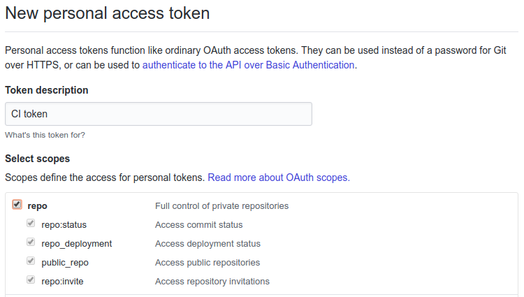
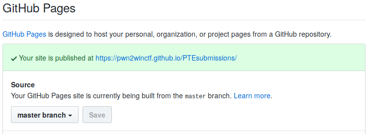
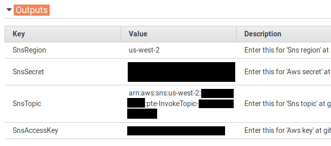
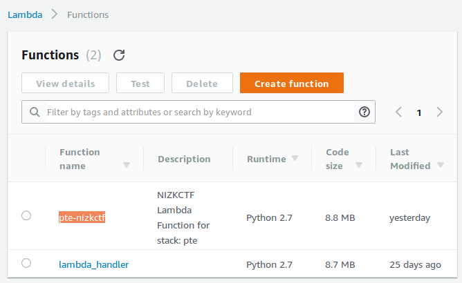
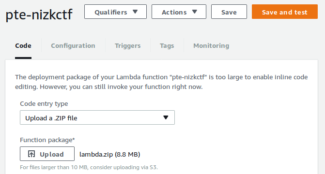

# Set up your own CTF (using GitHub)


## Create the bot user

NIZKCTF implements a bot to accept or reject pull requests containing team registrations or proof submissions. We will set up a GitHub user specifically for the bot, in order to ensure it holds the minimum privilege required for the platform to work.

1. Create a [GitHub user](https://github.com/join) for your bot.

2. Generate a fresh SSH key pair. If you already have a personal key pair, do not use it: [generate a new one](https://help.github.com/articles/generating-a-new-ssh-key-and-adding-it-to-the-ssh-agent/#generating-a-new-ssh-key) for the bot. [Add the public key](https://help.github.com/articles/adding-a-new-ssh-key-to-your-github-account/) to the bot's GitHub account and save the private key for later.

3. Generate a GitHub [personal access token](https://github.com/settings/tokens/new) for the bot. Select the **repo** scope. Save the bot's token (the 40-digit hexadecimal string) for later.
   


## Set up the CTF repositories

In NIZKCTF we split a CTF into two repositories. The main repository holds the platform source code and the competition challenges. The submissions repository holds proofs submitted by teams and the scoreboard computed by the bot. Both repositories should be placed under the same GitHub organisation.

### Create an organisation

1. Make sure you are logged to GitHub as the user who manages the CTF (not as the bot).

2. [Create a GitHub organisation](https://github.com/organizations/new) if you do not already have one.

3. Remember to **never add the bot as a member of your organisation**. This would undermine the principle of least privilege.


### Create the submissions repository

1. Fork the [submissions repository](https://github.com/pwn2winctf/submissions) under your GitHub organisation.

2. Go to the repository settings and enable GitHub Pages.
   

3. Still under settings, go to the **Branches** tab and protect the master branch. The purpose is to ensure the bot cannot rewrite the commit history.
   

4. Still under settings, go to the **Collaborators & teams** tab and add the bot user as a collaborator with **Write** access.
   


### Create the main repository

1. Fork the [main repository](https://github.com/pwn2winctf/PTE) under the **same organisation** you have forked the submissions repository.

2. Go to the repository settings and enable GitHub Pages.

3. Clone the repository to make your changes. Use the `./ctf add` command to prepare new challenges for your CTF.

5. Edit `settings.json`. Change `ctf_name` to the name of your CTF, and `submissions_project` to the fully qualified name (`"organisation/submissions_repository"`) of your submissions repository. Beware it is case-sensitive.


## Prepare a Zip file for AWS Lambda

The AWS Lambda environment lacks several command line tools which are required by the bot. Therefore, we need to pack in a Zip file the main repository code together with some binaries.

1. Download the [required binaries](https://github.com/pwn2winctf/nizkctf-tutorial/releases/download/20170908/binaries.tgz).

2. Unpack it inside the main repository directory: `tar -zxf binaries.tgz`.

3. Create a Zip file containing everything: `zip -ry ../lambda.zip * .git*`.

**NOTE**: Currently, the bot does not run a `git pull` to get updates from the main repository. Therefore, the bot only knows about the challenges included in the Zip file: if you release new challenges during the course of the CTF, you need to update the Zip file. This is because AWS Lambda unpacks the Zip contents to a read-only location. In the future, we may change NIZKCTF to copy the repository to a temporary (writeable) directory and automatically pull any changes, but this is not the current behaviour.


## Set up the bot in AWS

### Bring the CloudFormation Stack up

1. Go to [Create Stack](https://us-west-2.console.aws.amazon.com/cloudformation/home?region=us-west-2#/stacks/new) in the CloudFormation console.

2. Select **Upload a template to Amazon S3** and send our [nizkctf.template file](github/nizkctf.template). Click **Next**.

3. Fill the form:
   * **Stack Name**: Some name identifying your CTF, e.g. `myctf2017`.
   * **GitHubToken**: The personal access token (40-digit hexadecimal string) you generated for the bot.
   * **GitUserEmail**: The e-mail address which will appear in commits made by the bot. It should match the e-mail address registered in the bot's GitHub account.
   * **GitUserName**: The author name which will appear in commits made by the bot, e.g. `CTF Bot`.
   * **SSHIdentity**: The bot's SSH private key as a base64-encoded string. We need to encode it as base64 because AWS does not support a multi-line field here. You may encode the key by running the command `base64 -w0 keyfile`.

4. Click **Next**.

5. At the bottom of the page, mark the checkbox **I acknowledge that AWS CloudFormation might create IAM resources**. Click **Create**.

6. After a couple of minutes, the CloudFormation stack will be created.
   

7. Click the stack name. Open the **Outputs** item. Take note of the values displayed there.
   


### Upload the Zip file to AWS Lambda

1. Go to the [AWS Lambda console](https://us-west-2.console.aws.amazon.com/lambda/home?region=us-west-2#/functions). Click on the Lambda function corresponding to the stack you have just created.
   

2. Click on the **Upload** button and select the zip file. After that, click on **Save**.
   


## Set up the GitHub hook

### Create the hook

1. In the submissions repository settings, go to **Integration & services**. Click **Add service** and select **Amazon SNS**.
   

2. Fill **Aws key**, **Sns topic**, **Sns region** and **Aws secret** with the outputs from CloudFormation. Then, click on **Add Service**.


### Change the hook events

By default, GitHub will trigger SNS in response to (and only to) push events, and currently we [cannot change](https://stackoverflow.com/a/43522648) the list of events from the GUI. Therefore, we need to call the API to tell GitHub we want to trigger the SNS on pull request events.

1. Create a [Personal Access Token](https://github.com/settings/tokens) for your account. You already have one for the bot account, but you need another one for your own account to be able to change the repository settings. You must enable at least the **admin:repo_hook** scope for this token.
   

2. Run the following commands in the shell:
   ```bash
   token="your personal access token"
   repo="organisation/submissions_repository"

   id=$(curl -H "Authorization: token $TOKEN" https://api.github.com/repos/$repo/hooks | jq '.[] | select(.name=="amazonsns") | .id')

   curl -X PATCH -d '{"events":["pull_request"]}' -H "Authorization: token $TOKEN" https://api.github.com/repos/$repo/hooks/$id
   ```
   If you do not want to install the recommended [jq](https://stedolan.github.io/jq/) tool (which is available as a package in most Linux distribution repositories), you may instead manually collect the `id` from the `curl` output.


## Testing and troubleshooting

You can test if everything is working by registering a new team as if you were a CTF competitor.

To deregister the test team, just make a commit removing the team's directory from the submissions repository. Remember your user has write access to the repository, thus you do not need to submit these changes through pull requests (which would be denied by the bot).

For troubleshooting, read the AWS Lambda function logs stored at [CloudWatch](https://us-west-2.console.aws.amazon.com/cloudwatch/home?region=us-west-2#logs:).

If the bot encounters an error when trying to merge a pull request, it will log the stacktrace to CloudWatch. The bot will then post the execution ID, which you may search in the log, to a pull request comment before closing it.
